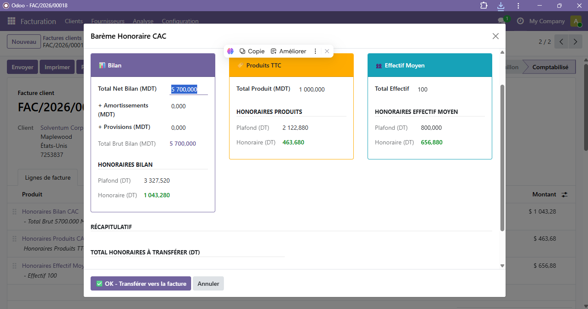
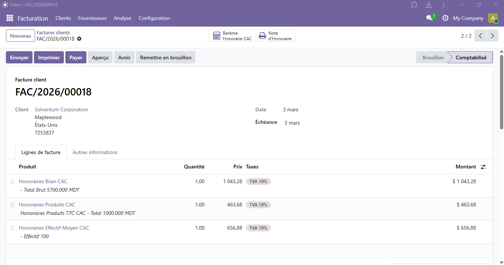
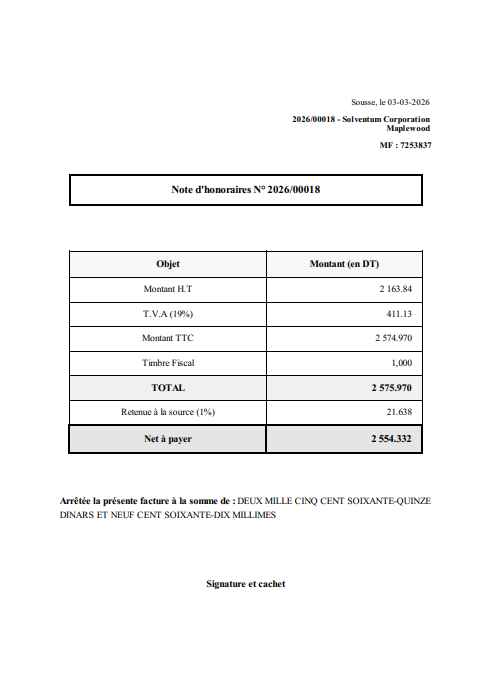

# Migration Mozaiss → Odoo 19
## Barème Honoraire CAC (Commissaires Aux Comptes)

[](https://www.odoo.com)
[](https://www.python.org)

---

## 📋 Description

Migration complète de la fonctionnalité **barème de calcul des honoraires CAC** du logiciel **Mozaiss** (C# WinForms) vers **Odoo 19**.

Le module implémente un système de calcul automatique des honoraires pour missions de Commissariat Aux Comptes selon un barème légal progressif basé sur trois critères :
- 📊 **Total brut du bilan** de l'entreprise auditée (en MDT)
- 🏷️ **Chiffre d'affaires** (produits TTC en MDT)
- 👥 **Effectif moyen** de l'entreprise

---

## ✨ Fonctionnalités

### Core
- ✅ **Calcul automatique** selon 3 barèmes progressifs par tranches
- ✅ **Interface wizard** intuitive en 3 colonnes (Bilan | Produits | Effectif)
- ✅ **Recalcul en temps réel** lors de la saisie des montants
- ✅ **Validation et transfert** automatique vers les lignes de facture
- ✅ **Stockage des données** du barème sur la facture

### Rapports
- ✅ **Génération PDF** "Note d'Honoraire" conforme au template Mozaiss
- ✅ **Mise en page professionnelle** avec calculs détaillés (HT, TVA, TTC, Timbre, Retenue)
- ✅ **Montant en lettres** automatique

### Intégration
- ✅ **Bouton dédié** dans le formulaire facture (accessible uniquement sur factures clients)
- ✅ **Produits CAC** pré-configurés (Honoraires Bilan, Produits, Effectif)
- ✅ **Droits d'accès** configurés pour le groupe Comptabilité
- ✅ **Compatible** avec les workflows standards Odoo (validation, paiement, etc.)

---

## 🛠️ Stack technique

| Composant | Technologie | Version |
|-----------|-------------|---------|
| **ERP** | Odoo Community | 19.0 |
| **Backend** | Python | 3.10+ |
| **Frontend** | XML QWeb, Bootstrap | - |
| **Base de données** | PostgreSQL | 15/16 |
| **Rapports** | QWeb Templates | - |
| **ORM** | Odoo ORM | Native |

---

## 📦 Structure du module

```
mozaiss_honoraires/
├── __manifest__.py                        # Déclaration du module
├── __init__.py
│
├── models/
│   ├── __init__.py
│   └── account_move.py                    # Extension modèle facture
│
├── wizard/
│   ├── __init__.py
│   ├── bareme_honoraire_wizard.py         # Logique calcul barèmes
│   └── bareme_honoraire_wizard_views.xml  # Interface wizard
│
├── views/
│   └── account_move_views.xml             # Bouton "Barème Honoraire CAC"
│
├── report/
│   ├── note_honoraire_report.xml          # Déclaration rapport
│   └── note_honoraire_template.xml        # Template PDF QWeb
│
├── security/
│   └── ir.model.access.csv                # Droits d'accès
│
├── data/
│   └── product_data.xml                   # Produits CAC pré-configurés
│
└── README.md                               # Ce fichier
```

---

## 🚀 Installation

### Prérequis

- Odoo 19 installé et fonctionnel
- PostgreSQL 15/16
- Modules Odoo installés :
  - `account` (Facturation)
  - `sale_management` (Ventes)
  - `purchase` (Achats)

### Étapes d'installation

1. **Copier le module** dans le dossier addons d'Odoo :
2. **Redémarrer Odoo** :
3. **Activer le mode développeur** :
   - Aller dans `Paramètres` → `À propos`
   - Cliquer sur `Activer le mode développeur`

4. **Mettre à jour la liste des modules** :
   - `Paramètres` → `Applications`
   - Cliquer sur `Mettre à jour la liste des applications`

5. **Installer le module** :
   - Rechercher : `Barème Honoraires CAC` ou `mozaiss`
   - Cliquer sur `Installer`


## 📊 Utilisation

### Workflow complet

1. **Créer ou ouvrir une facture client**
   - Aller dans `Facturation` → `Clients` → `Factures`
   - Créer une nouvelle facture ou ouvrir une facture brouillon

2. **Lancer le barème CAC**
   - Cliquer sur le bouton `🧮 Barème Honoraire CAC` en haut de la facture

3. **Saisir les montants**
   - **Bilan** : Total Net Bilan + Amortissements + Provisions (en MDT)
   - **Produits TTC** : Chiffre d'affaires TTC (en MDT)
   - **Effectif Moyen** : Nombre de salariés

4. **Validation**
   - Les honoraires sont calculés automatiquement en temps réel
   - Cliquer sur `✅ OK - Transférer vers la facture`
   - 3 lignes sont ajoutées automatiquement :
     - Honoraires Bilan CAC
     - Honoraires Produits CAC
     - Honoraires Effectif Moyen CAC

5. **Générer la Note d'Honoraire**
   - Cliquer sur le bouton `🖨️ Note d'Honoraire`
   - Le PDF est généré avec le template professionnel

---

## 🧪 Exemple de test

### Jeu de données

| Critère | Valeur saisie | Résultat attendu |
|---------|---------------|------------------|
| **Bilan** |  |  |
| - Total Net Bilan | 5 000 MDT | - |
| - Amortissements | 500 MDT | - |
| - Provisions | 200 MDT | - |
| - **Total Brut Bilan** | **5 700 MDT** | **Honoraire : 1 043,28 DT** |
| **Produits TTC** | 1 000 MDT | **Honoraire : 463,680 DT** |
| **Effectif Moyen** | 100 personnes | **Honoraire : 656,880 DT** |
| **TOTAL HT** | - | **2 163,84 DT** |

---

## 🔢 Algorithmes de calcul

Les trois barèmes sont progressifs par tranches avec des taux marginaux décroissants.

### Exemple : Barème Bilan

| Tranche (MDT) | Taux marginal | Plafond cumulé (DT) |
|---------------|---------------|---------------------|
| 0 – 300 | Forfait 700 DT | 0 |
| 300 – 1 000 | 115,456% | 700 |
| 1 000 – 3 000 | 77,28% | 1 781,92 |
| 3 000 – 7 000 | 38,64% | 3 327,52 |
| 7 000 – 15 000 | 15,46% | 4 873,12 |
| ... | ... | ... |

> **Note** : Les taux sont conformes à la réglementation tunisienne en vigueur.

Pour les détails complets des 3 barèmes, voir le code source dans `wizard/bareme_honoraire_wizard.py`.

---

## 🎨 Captures d'écran

### Interface wizard barème CAC


### Facture avec lignes générées


### Rapport PDF Note d'Honoraire


---

## 🔧 Configuration

### Personnalisation des produits

Les produits CAC sont pré-créés lors de l'installation. Pour les modifier :

1. Aller dans `Ventes` → `Produits` → `Produits`
2. Rechercher : `Honoraires CAC`
3. Modifier les propriétés (nom, compte comptable, taxes, etc.)

### Droits d'accès

Par défaut, le module est accessible aux groupes :
- `Comptabilité : Utilisateur`
- `Comptabilité : Gestionnaire`

Pour modifier : `Paramètres` → `Technique` → `Sécurité` → `Droits d'accès`

---

## 📚 Documentation technique

### Rapport complet

Un rapport technique détaillé est disponible dans `docs/rapport_technique.pdf` couvrant :
- Analyse du code C# source
- Architecture du module Odoo
- Migration des algorithmes
- Template PDF QWeb
- Tests et validation
- Difficultés rencontrées et solutions

### Code source commenté

Le code Python est entièrement commenté en français avec :
- Docstrings pour chaque fonction
- Explications des algorithmes de barème
- Correspondances avec le code C# original

---

## 🐛 Dépannage

### Le bouton "Barème Honoraire CAC" n'apparaît pas

**Causes possibles** :
- La facture n'est pas de type "Facture client" (vérifier `move_type`)
- Le module n'est pas correctement installé
- Le cache du navigateur

### Erreur "timbre_fiscal field is undefined"

**Solution** : Ajouter le champ manquant dans PostgreSQL :
```sql
ALTER TABLE account_move 
    ADD COLUMN IF NOT EXISTS timbre_fiscal numeric DEFAULT 1.0;
```

### Problème d'encodage dans le PDF

**Solution** : Le template utilise `web.basic_layout` pour éviter les problèmes d'encodage UTF-8.

---

## 👤 Auteur

**Mohamed ZEIRI**

- 📧 Email : zeiri.mohamed000@gmail.com
- 💼 LinkedIn : https://www.linkedin.com/in/mohamed-zeiri/
- 🐙 GitHub : mohamedzeiri

---

## 🔗 Liens utiles

- [Odoo Documentation Officielle](https://www.odoo.com/documentation/19.0/)
- [Odoo Developer Guide](https://www.odoo.com/documentation/19.0/developer/)
- [PostgreSQL Documentation](https://www.postgresql.org/docs/)
- [Python Documentation](https://docs.python.org/3/)

---
